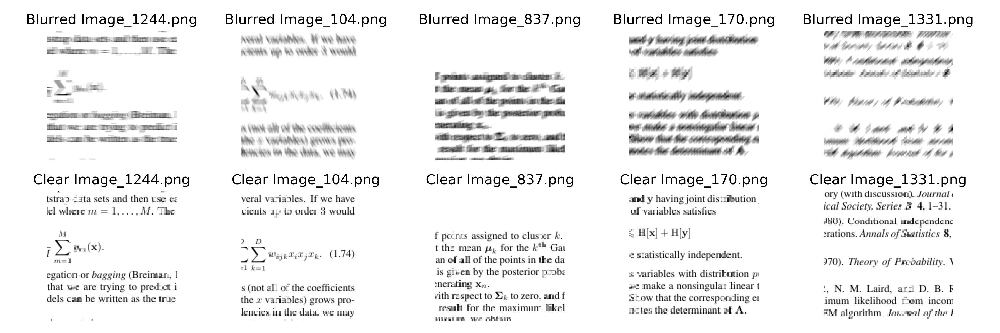
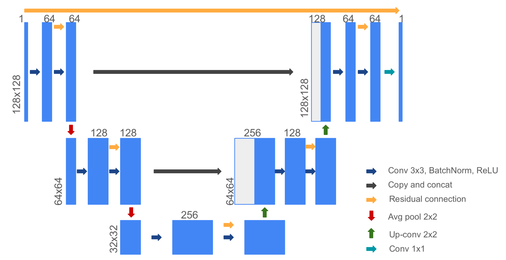
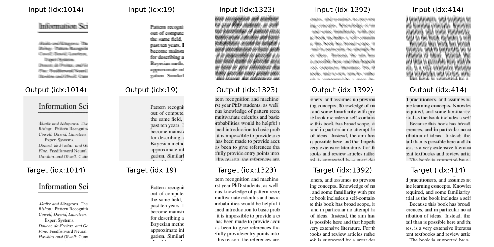

# Text Sharpener

This repository contains the implementation of a Convolutional Neural Network (CNN) model to denoise and deblur text images, improving their readability and clarity. The model extends the U-Net architecture and is trained on synthetic blurry images, optimizing a combined objective of reconstruction and edge loss. 

<!-- TABLE OF CONTENTS -->

  
Table of Contents

  <ol>
    <li>
      <a href="#overview">Overview</a>
    <li>
      <a href="#dataset">Results</a>
    <li>
      <a href="#architecture">Architecture</a>
    <li>
      <a href="#results">Results</a>
  <ol>

## Overview

Blurry text in images poses significant challenges for readability and information extraction, often caused by noise, motion blur, or poor lighting conditions. This project aims to address these issues by developing a CNN-based solution that significantly enhances text image quality.

Key features include: 
- Development of a modified U-Net architecture tailored for text deblurring tasks
- Implemented a combined objective of reconstruction and edge loss
- Improved Peak Signal-to-Noise Ratio (PSNR) on the testing set by **62%**, from **16.97 dB** to **27.21 dB**.

## Dataset
The dataset was sourced from the textbook Pattern Recognition and Machine Learning (2006) by Christopher Bishop. Motion blur was randomly applied to generate input and target pairs. 

## Architecture 
The model builds upon the **U-Net** architecture with modifications to enhance performance:
- Residual connections added to double convolution blocks for better gradient flow.
- Average pooling used instead of max pooling in downsampling layers to retain context.
- Padding applied to convolutional layers to prevent spatial size reduction.
- Global skip connection directly from input to output for residual learning.

## Results
Improved from **16.97 dB** to **27.21 dB** on the test set.

(<a href="#readme-top">back to top</a>)

